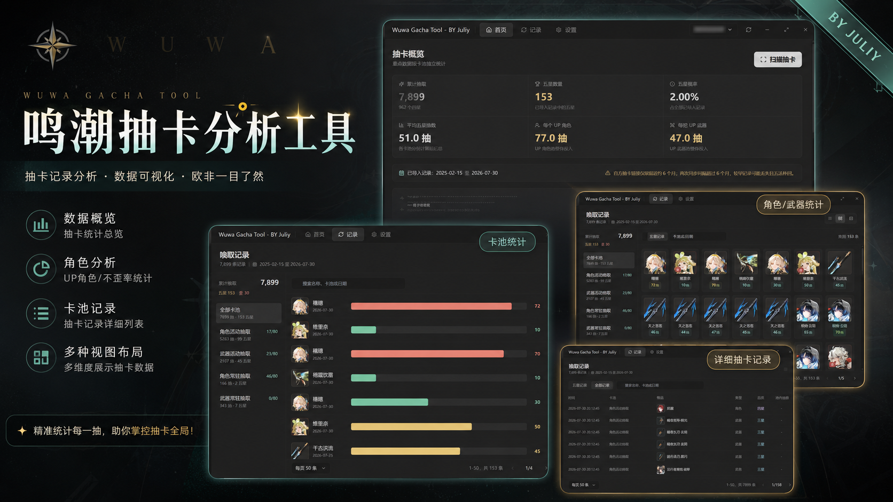
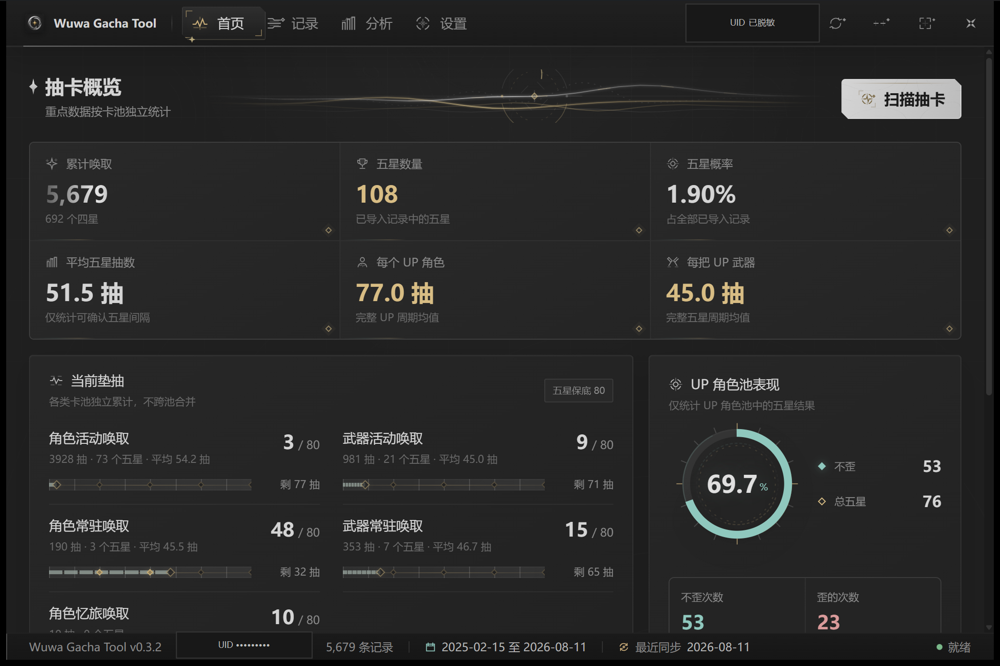
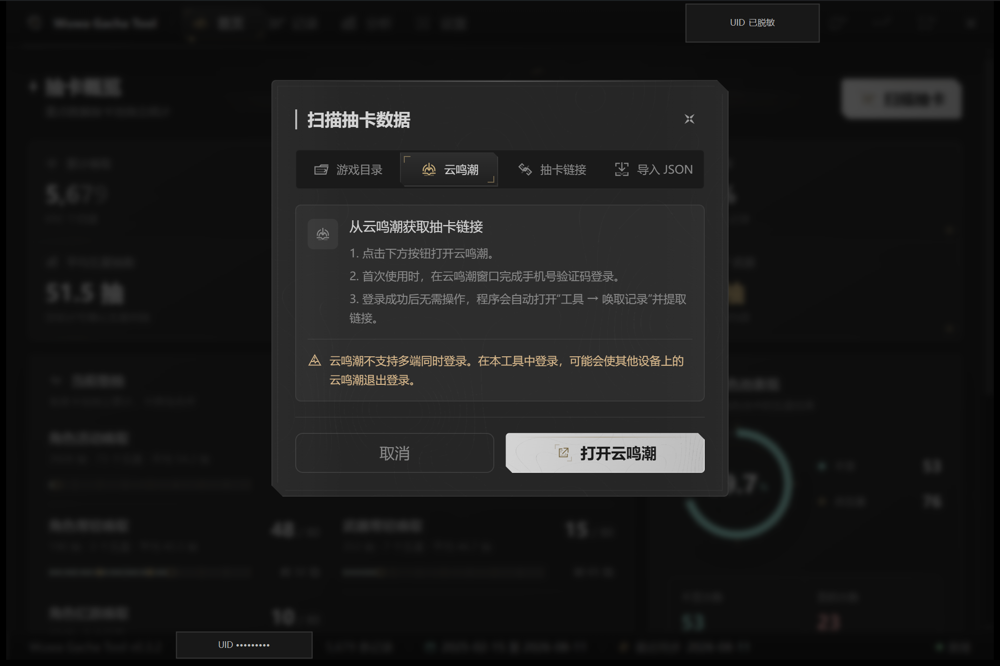
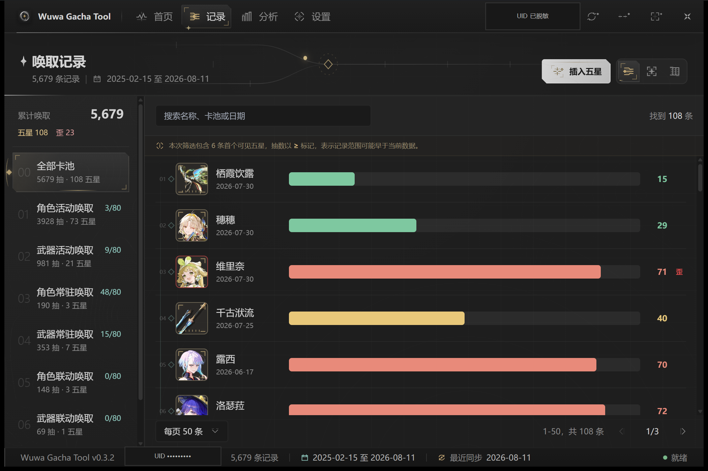
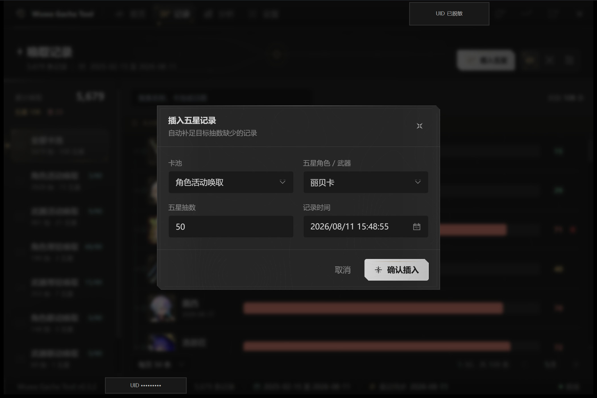
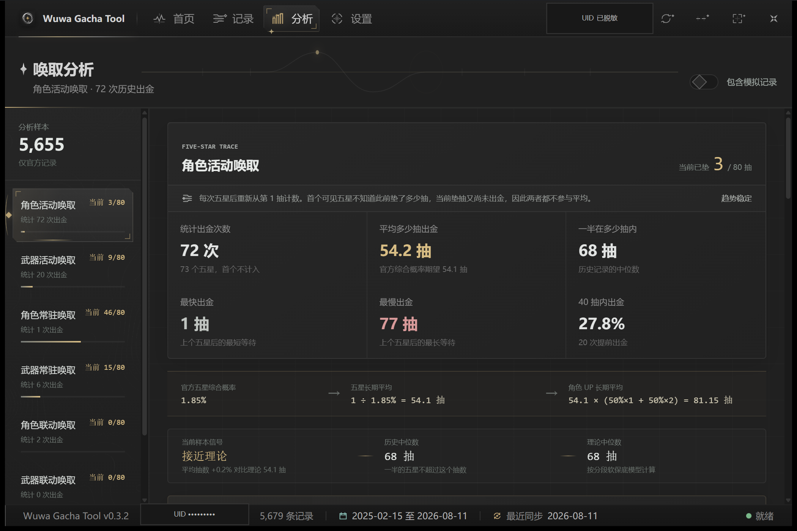
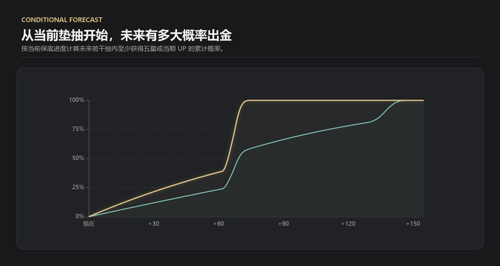
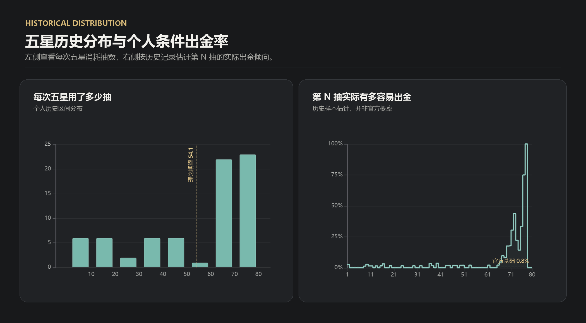
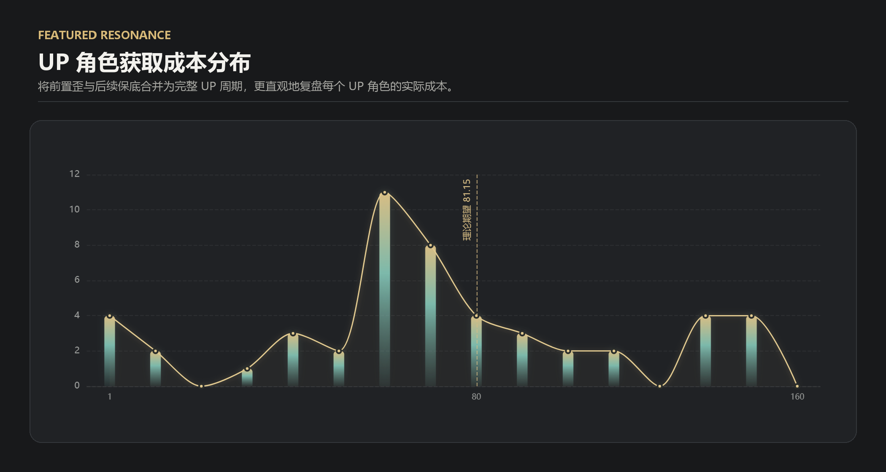
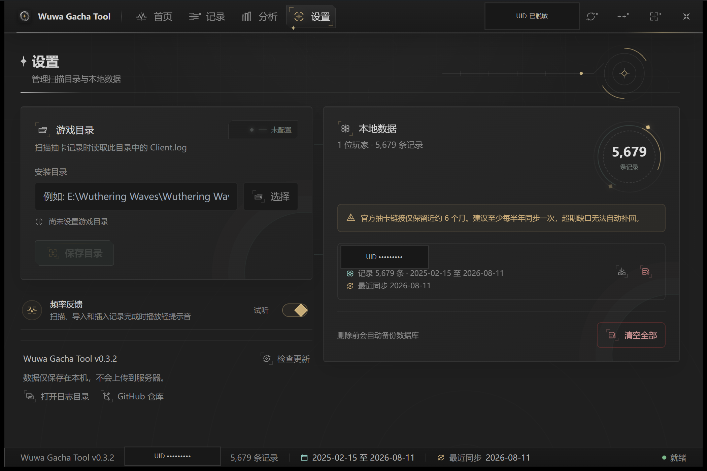

# Wuwa Gacha Tool

一款面向《鸣潮》玩家的本地抽卡记录管理与分析工具，用于同步唤取历史、追踪各卡池垫抽、复盘五星获取成本，并通过理论对照与条件概率帮助理解当前抽卡表现。

当前源码版本 **v0.3.2** · 作者 Juliy



> 所有示例截图均已对 UID 等私人信息进行脱敏处理。

---

## 核心特性

- **四种数据导入方式**：游戏目录自动读取、云鸣潮自动提取、抽卡链接直连、本地 JSON 导入
- **多账号独立管理**：按 UID 分库存储、切换、统计、导出与清理，卡池数据互不混合
- **八类卡池独立统计**：分别计算累计抽数、五星区间、当前垫抽与保底进度
- **唤取分析页面**：提供历史中位数、理论中位数、样本信号、条件概率预测与五星分布
- **UP 表现复盘**：区分总体不歪率、歪/不歪次数与完整 UP 周期成本
- **五星获取成本**：点击列表、宫格或表格中的五星，可查看逐次获取、前置歪、总抽数与平均成本
- **多视角记录浏览**：列表、宫格、表格三种布局，支持卡池筛选、搜索与分页
- **规则校验的手动补录**：按目标抽数插入五星，自动补齐符合四星保底与卡池规则的记录
- **模拟记录可编辑**：仅手动生成的数据允许编辑或删除，真实扫描/导入记录始终只读
- **同步新鲜度提醒**：记录最近完整同步时间，并按风险等级提示可能的数据缺口
- **本地备份与诊断**：删除前自动备份数据库，可快捷打开备份目录和诊断日志目录
- **自动更新**：支持应用内检查更新、下载代理切换与超时回退

---

## 界面导览

应用采用鸣潮风格的深色界面，顶部提供 **首页 / 记录 / 分析 / 设置** 四个页面入口，右侧可切换玩家、刷新数据并控制窗口；底部状态栏持续显示版本、当前玩家、记录范围、最近同步时间和运行状态。

### 首页 · 抽卡概览



首页集中展示当前玩家最常用的数据：

- 六项核心指标：累计唤取、五星数量、五星概率、平均五星抽数、每个 UP 角色、每把 UP 武器
- 各卡池当前垫抽与 `80` 抽保底进度，卡池之间独立累计
- UP 角色池总体不歪率、五星结果数量与歪的次数
- 最近五星记录、所属卡池、获取日期与区间抽数
- 官方记录时间范围与最近同步状态

点击右上角「扫描抽卡」可选择以下方式：

| 方式 | 适用场景 | 说明 |
| --- | --- | --- |
| 游戏目录 | 本机安装鸣潮 | 读取 `Client\Saved\Logs\Client.log`，自动提取链接并同步 |
| 云鸣潮 | 不方便读取本地日志 | 打开云鸣潮并在登录后自动进入唤取记录页面提取链接 |
| 抽卡链接 | 已有完整链接 | 直接粘贴官方唤取记录链接并导入 |
| 导入 JSON | 迁移或恢复 | 导入本工具导出的数据，或兼容官方接口结构的 JSON |

#### 云鸣潮提取



首次使用需要在打开的云鸣潮窗口中完成手机号验证码登录。登录成功后，工具会自动打开「工具 → 唤取记录」并提取链接；用户确认后再执行导入。

> 云鸣潮不支持多端同时登录，在本工具中登录可能使其他设备上的云鸣潮退出登录。

### 记录 · 唤取记录



- 左侧按玩家可识别的卡池类型展示记录量、五星数和当前垫抽
- 主区域支持列表、宫格、表格三种视图，以及名称、卡池和日期搜索
- 首个可见五星若缺少更早记录，会以 `≥` 标记区间下界，避免把不完整区间当成精确抽数
- 点击任意五星可打开获取档案：活动角色池会把前置歪计入对应 UP 成本，其他池型按各自规则汇总
- 表格视图可在「五星记录」和「全部记录」间切换，并显示模拟记录的编辑入口

#### 手动补录五星



补录时选择卡池、五星角色或武器、目标抽数和记录时间。工具会在写入前生成插入计划，并自动补齐所需三星、四星记录：

- 角色池只能选择五星角色，武器池只能选择五星武器
- 活动角色池会校验歪后下一次必为 UP；常驻池和武器池按对应规则处理
- 四星基础概率为 6%，并保证连续 10 抽内至少出现一次四星或以上
- 不同 UID、不同卡池互不继承垫抽；多条五星同秒时使用稳定顺序计算
- 插入计划会在数据库事务内重新校验，数据变化或规则冲突时整批拒绝

手动生成的数据会标记为模拟记录。模拟五星及其补足批次可以编辑或删除；真实扫描和 JSON 导入的数据不会开放修改入口，后端同样会拒绝修改。

### 分析 · 唤取表现



分析页按卡池独立计算，避免不同规则的记录互相污染：

- 五星区间次数、平均抽数、中位数、最快/最慢出金与前 40 抽出金率
- 官方五星综合概率 `1.85%`、长期平均 `54.1` 抽，以及角色 UP 长期平均 `81.15` 抽的理论对照
- 历史中位数、理论中位数和当前样本信号；样本不足时不会直接判断“欧/非”
- 从当前垫抽出发的条件概率预测，展示未来若干抽内至少出一个五星或获得当期 UP 的概率
- 历史记录曲线仅作为样本估计，并明确区分官方理论值与个人历史表现
- 可选择是否包含模拟记录，便于分别查看官方记录和完整本地数据

#### 当前垫抽概率预测



从当前垫抽和保底状态继续向后计算，分别展示未来若干抽内至少获得五星、以及获得当期 UP 的累计概率，便于直观看到软保底和大保底带来的概率变化。

#### 五星历史分布



左图汇总每次五星实际消耗的抽数，并用理论长期平均值辅助对照；右图按个人历史记录估计第 N 抽的出金率。个人曲线只反映当前样本，不代表官方概率，样本较少时应谨慎解读。

#### UP 角色获取成本



角色活动池会把前置歪与后续保底合并为完整的 UP 获取周期，展示每个 UP 角色的总抽数及成本分布，并与角色 UP 长期平均 `81.15` 抽进行对照。

### 设置 · 目录、数据与诊断



- 配置并校验鸣潮安装目录，保存后用于游戏目录扫描
- 展示本地玩家数量、记录总数、每位玩家的记录范围和最近同步时间
- 按 UID 导出 JSON，导出结构可直接重新导入或用于跨设备迁移
- 单独删除某位玩家或清空全部记录；确认弹窗会明确展示影响范围
- 所有删除操作执行前先创建完整数据库备份，备份失败则不会删除任何数据
- 备份创建后可直接打开备份目录，也可从设置页打开诊断日志目录
- 检查应用更新、查看 GitHub 仓库，并控制扫描/导入完成时的提示音

### 同步与状态提醒

应用只有在所有官方卡池均成功返回后，才会记录一次完整同步时间。状态栏和设置页会根据距上次同步的时间给出分级提醒；升级前已有的数据会标记为根据记录范围推断。

官方抽卡链接通常只保留近约 6 个月。建议至少每半年完整同步一次；若期间没有抽卡则不会产生缺口，但超出保留期的历史记录无法由工具自动补回。

---

## 推荐使用流程

1. 在游戏内打开一次唤取记录页面，让日志写入最新链接；或准备使用云鸣潮提取
2. 回到首页点击「扫描抽卡」，选择游戏目录、云鸣潮、抽卡链接或 JSON
3. 确认导入后，在首页查看概览，在记录页检查明细
4. 进入分析页按卡池查看实际表现、理论对照和当前条件概率
5. 多账号用户通过右上角玩家选择器切换 UID
6. 定期同步，并在设置页按 UID 导出 JSON 作为额外备份

---

## 数据、隐私与安全边界

- 抽卡记录、设置、备份和诊断日志均保存在本机，不会上传到项目自建服务器
- 游戏目录模式仅读取 `Client.log` 以提取官方抽卡链接，不读取游戏账号密码
- 云鸣潮模式需要访问云鸣潮并完成其官方登录流程，工具只提取唤取记录链接
- 数据同步使用官方抽卡接口；自动更新会访问 GitHub Release 及配置的下载代理
- 删除操作会区分当前玩家和全部玩家，且不会删除应用设置、导出的 JSON 或已有备份文件
- 诊断日志记录关键流程与错误信息，不记录完整抽卡链接等敏感凭据

---

## 注意事项

- 使用游戏目录扫描前，请先在游戏内打开一次唤取记录页面，否则日志中可能没有可用链接
- JSON 导入需包含 `uid` 与卡池数据；推荐直接使用本工具导出的文件
- 手动补录不会自动修复原始数据中已经存在的规则冲突，异常边界可能导致插入被拒绝
- 首个可见五星之前的记录可能不完整，因此相关抽数会显示为下界而不是伪精确值
- 如遇同步、资源或更新问题，可先在设置页打开日志目录查看诊断信息


---

## 本地开发

### 环境要求

项目使用 **React + TypeScript + Vite + Tauri 2 + Rust**。仓库的 GitHub Actions 当前使用以下构建基线：

- Node.js 24
- npm（使用仓库内的 `package-lock.json`）
- Rust stable
- Windows 主目标：`x86_64-pc-windows-msvc`

在 Windows 上还需要：

- Microsoft C++ Build Tools（勾选“使用 C++ 的桌面开发”）
- Microsoft Edge WebView2 Runtime
- Git

其他系统需要先安装对应平台的 Tauri 2 系统依赖。部分游戏目录扫描和云鸣潮流程主要面向 Windows 环境。

### 获取源码与安装依赖

```powershell
git clone https://github.com/juliy819/wuwa-gacha-tool.git
cd wuwa-gacha-tool
npm ci
```

推荐使用 `npm ci` 严格按锁文件安装依赖；需要调整依赖版本时再使用 `npm install`。

### 启动桌面开发环境

```powershell
npm run tauri:dev
```

该命令会自动启动 Vite 开发服务器，并打开连接真实 Rust 后端的 Tauri 窗口。首次编译 Rust 依赖可能需要较长时间。

如只需检查前端样式，可以运行：

```powershell
npm run dev
```

浏览器模式无法完整使用数据库、文件选择、日志解析、云鸣潮窗口和自动更新等 Tauri 能力，因此不能替代桌面端功能验证。

### 常用检查命令

```powershell
# TypeScript 类型检查
npm run check

# ESLint
npm run lint

# 前端生产构建
npm run build

# 云鸣潮脚本测试
npm run test:cloud-gacha

# 同步时间语义测试
npm run test:sync

# Rust 测试
cargo test --manifest-path src-tauri/Cargo.toml
```

涉及 UI 的修改除通过类型检查和构建外，还应在真实 Tauri 窗口中检查页面切换、弹窗、滚动、窗口缩放和数据状态。

---

## 本地构建

### 构建安装包

```powershell
npm run tauri -- build
```

Tauri 会先执行前端生产构建，再编译 Rust 后端并生成当前平台的安装产物。Windows 构建结果通常位于：

```text
src-tauri/target/release/bundle/
```

可执行文件位于：

```text
src-tauri/target/release/wuwa-gacha-tool.exe
```

### 仅构建可执行文件

调试启动性能或不需要安装包时，可以跳过 bundle：

```powershell
npm run tauri -- build --no-bundle
```

仓库还提供首屏性能采样脚本：

```powershell
npm run perf:startup:build
```

本地构建产物默认不会被 Git 跟踪。正式发布包、更新签名和 `latest.json` 由 GitHub Actions Release 工作流生成，不应使用普通本地构建产物覆盖线上更新文件。

---

## 项目结构

```text
src/
├─ components/       通用界面组件与交互效果
├─ pages/            首页、记录、分析、设置页面
├─ services/         Tauri 命令调用封装
├─ store/            Zustand 状态管理
├─ hooks/            React Hooks
├─ lib/              前端统计与通用工具
└─ types/            TypeScript 类型

src-tauri/
├─ src/commands/     Tauri 命令入口
├─ src/db/           SQLite 数据库与备份逻辑
├─ src/gacha/        日志解析、数据请求与卡池规则
├─ capabilities/     Tauri 权限配置
└─ icons/            桌面应用图标

tests/               Node.js 自动化测试
scripts/             构建与性能辅助脚本
docs/screenshots/    README 页面截图
.github/workflows/   自动发布与资源工作流
```

前端只负责展示与发起命令；数据写入、删除保护、模拟记录边界和关键卡池规则由 Rust 后端再次校验，避免仅依赖界面限制。

---

## 发布流程

仓库的 Release 工作流支持推送 `v*` 标签或在 GitHub Actions 中手动触发。工作流会完成版本同步、Windows/Linux 构建、安装包整理、更新元数据生成和 GitHub Release 发布。

普通贡献不需要创建版本标签，也不要手动修改更新公钥或提交 `src-tauri/target/`、本地数据库、日志和导出的玩家数据。

---

## 参与贡献

欢迎提交 Issue 或 Pull Request。建议：

1. 从最新主分支创建独立功能分支
2. 保持改动范围聚焦，不混入本地数据、构建产物或无关格式化
3. 为数据规则、同步语义和后端边界补充对应测试
4. 提交前运行相关类型检查、测试和 Rust 测试
5. 涉及 UI 时附上脱敏截图或清晰的复现步骤

提交问题时可以附带设置页日志目录中的相关诊断片段，但请先确认其中不包含 UID、本地路径或其他私人信息。

---

## 许可证

本项目基于 [Apache License 2.0](LICENSE) 开源。使用、修改和分发时请遵守许可证条款，并保留必要的版权与许可证声明。
